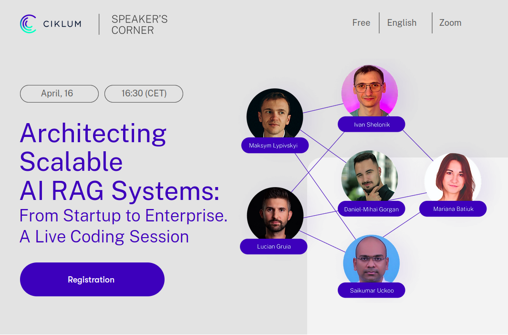

# llm-flask-rag-aws

Hi, pleased to meet you all.

Today We will deploy Llama-2-13B open-source LLM (can be any other HF LLM)  on an AWS EC2 instance armed with a robust 24GB GPU 
and using Cloud Formation YAML script we will establish the given infrastructure. 

We will Pack, build and run everything as a single docker-compose file which provides communication 
between GenAI RAG application with both open-source GPU powered LLM TGI inference and proprietary OpenAI LLM API 
for comparison purpose



This code release is being done as part of the speakers corner session that was conducted on 16th April 2024
https://www.landing.ciklum.com/sc-architecting-scalable-ai

- [Ciklum](https://www.ciklum.com/)

- [Youtube link](https://youtu.be/75Z-ei2d10k?si=VU6is3mJ1pH04VEr&t=824)

So, let's start

------------------------

## Commands to run LLM inference instance and Flask GenAI RAG app on AWS

### Create AWS CloudFormation stack with all AWS infrastructure
[how to create stack using console](https://docs.aws.amazon.com/AWSCloudFormation/latest/UserGuide/cfn-console-create-stack.html)


### Download EC2 key pair
[how to download ec2 key pair](https://docs.aws.amazon.com/AWSEC2/latest/UserGuide/create-key-pairs.html#having-ec2-create-your-key-pair) 
and put it in the project root

### Change permissions of EC2 key

```bash
chmod 400 llm-key.pem
```

### Change EC2 Public IP format
Required "-" instead of "." for SSH connection 
```bash
PUBLIC_IP=X.XXX.XXX.XXX
PUBLIC_IP=$(echo "$PUBLIC_IP" | sed 's/\./-/g')
```

### SSH Into EC2 Instance using .pem key
```bash
ssh -i llm-key.pem ec2-user@ec2-${PUBLIC_IP}.compute-1.amazonaws.com
```

### Copy all the files from local pc to remote (git alternative)
Required to avoid messing up with git credentials during the demo 
```bash
scp -r -i llm-flask-rag-aws/llm-key.pem llm-flask-rag-aws ec2-user@ec2-${PUBLIC_IP}.compute-1.amazonaws.com:~/
```

### Install Docker-compose
```bash
sudo curl -L "https://github.com/docker/compose/releases/latest/download/docker-compose-$(uname -s)-$(uname -m)" -o /usr/local/bin/docker-compose
sudo chmod +x /usr/local/bin/docker-compose
```

### Run docker-compose which includes LLM inference instance and Flask GenAI RAG app
```bash
cd llm-flask-rag-aws
docker-compose build
docker-compose up
```

### Now, you can start communicate with both chats (openai & hf llama-2 13b) from the browser
```
http://{PUBLIC_IP}:5000/hf
http://{PUBLIC_IP}:5000/openai
```

### TGI overrides and set MAX_TOTAL_TOKENS automatically for Flash Attention models
- https://github.com/huggingface/text-generation-inference/issues/653

### Do not forget to clean all AWS CloudFormation resources
[how to delete aws cloudformation stack](https://docs.aws.amazon.com/AWSCloudFormation/latest/UserGuide/cfn-console-delete-stack.html)

------------------------

